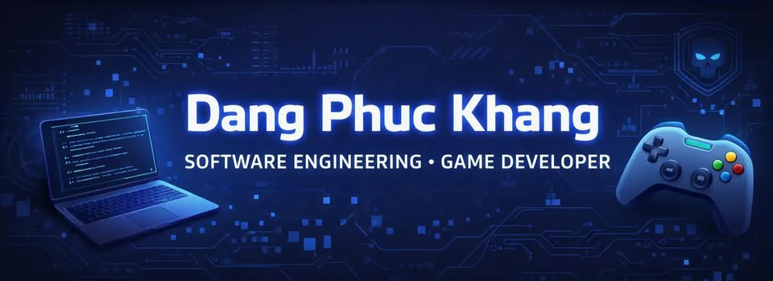

  

### 👋 Hi, I'm Dang Phuc Khang

I'm Software Engineering student specializing in backend development with Java Spring Boot and RESTful APIs.

Experienced in building scalable systems and working with AI models, with a strong focus on clean code and system design. 

Seeking an internship to contribute to real-world backend systems and grow as a software engineer.
 

## Let's Connect

## Skills & Expertise

<table>
  <tr>
    <td valign="top" width="50%">

**🎯 Leadership & Strategy**
 

 

**☁️ Cloud & Infrastructure**
 

</td>
<td valign="top" width="50%">

**💻 Languages & Frameworks**
 

)

 

**🤖 Database & ORM**
 

 

**🛠️ Other Tools**
 

</td>
</tr>
</table>

## Previously Worked With

---
